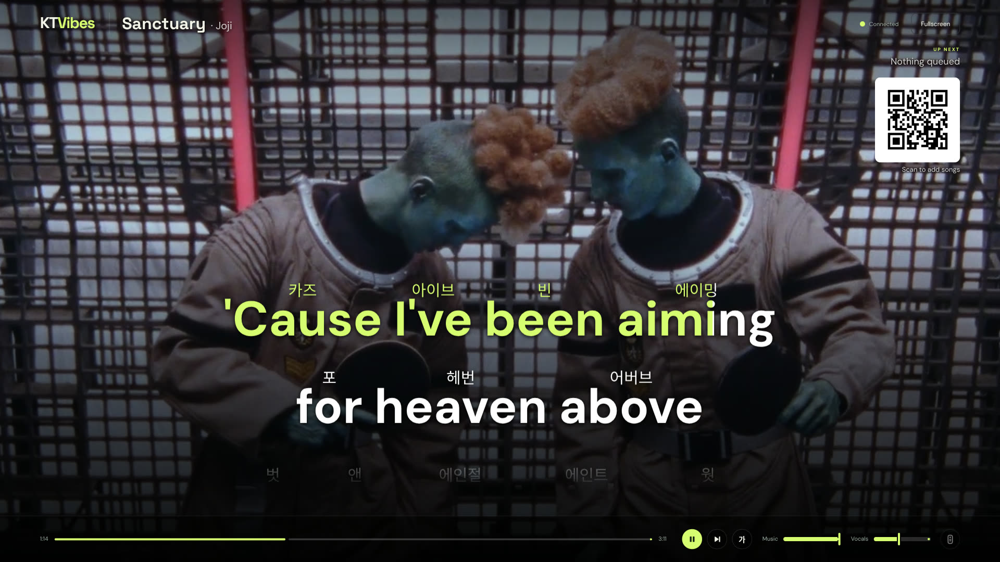

# KTVibes

**Turn any YouTube song into karaoke at home.** Pick songs on your phone, sing on the TV. KTVibes downloads the song, strips the vocals with AI, finds synced lyrics, and shows them with a KTV-style wipe. It adds pronunciation guides for Chinese, Cantonese, Korean and Japanese.


<p align="center">
  
  &nbsp;
  
</p>

## Features

- **Any song on YouTube.** Search from your phone. Results skip reactions, dance practices, mixes and karaoke tracks.
- **AI vocal removal** (Demucs) runs on an NVIDIA GPU or Apple Silicon. A **Vocals** slider keeps as much of the original singer as you want, and a **Music** slider sets the backing track.
- **Synced lyrics** come from [LRCLIB](https://lrclib.net). Each character or word fills as it is sung, timed by forced alignment against the separated vocals.
- **Pronunciation guides** sit above the lyrics. Cycle them with **G** or from the remote.
  - Chinese: pinyin, and Hangul.
  - Cantonese: jyutping. Songs written in Cantonese switch to it automatically.
  - Korean: romanization of the sung pronunciation.
  - Japanese: romaji.
  - English: Hangul.
- **Key and speed.** Shift the key ±6 semitones without changing tempo, or slow a song down without changing pitch.
- **Phone remote.** Scan the QR code on the TV to join. Everyone shares one queue: reorder, undo removals, and re-add recent songs. The TV shows a popup card for every change.
- **Lyrics language picker.** If a song has lyrics in several languages or editions (e.g. a K-pop song's Japanese release), choose which one to show.

<p align="center">
  
  
</p>

## Install

You need a computer connected to the TV, and phones on the same Wi-Fi. An NVIDIA GPU (CUDA 12.8 driver) or an Apple Silicon Mac makes song preparation fast. Without one, KTVibes falls back to the CPU, which is slower.

**Linux / macOS**

```bash
curl -LsSf https://raw.githubusercontent.com/andyleenz/KTVibes/main/install.sh | bash
```

The script needs `git`, `ffmpeg` and Node.js 22+, and tells you how to install any that are missing (`brew install git ffmpeg node` on macOS). It installs [uv](https://docs.astral.sh/uv/), clones KTVibes to `~/KTVibes`, and adds a `ktvibes` command.

**Windows** (PowerShell, untested so far; reports welcome)

```powershell
powershell -ExecutionPolicy ByPass -c "irm https://raw.githubusercontent.com/andyleenz/KTVibes/main/install.ps1 | iex"
```

This installs Git, FFmpeg, Node.js and uv with `winget` if they are missing.

**Manual**

```bash
git clone https://github.com/andyleenz/KTVibes.git && cd KTVibes
uv sync
uv run ktvibes
```

The first song takes longer: the separation model (80 MB) and the alignment model (1.2 GB) download on first use.

## Use

1. Run `ktvibes`.
2. On the TV computer, open `http://localhost:8765/tv` and click **Enable sound**. Click **Fullscreen** if you like.
3. Scan the QR code with a phone, search for a song, and tap it to queue it.

The first song starts as soon as it is ready. Later songs are prepared while earlier ones play. Re-queuing a song is instant because everything is cached in `cache/`.

## Configuration

| Variable | Default | |
|---|---|---|
| `KTVIBES_PORT` | `8765` | Server port |
| `KTVIBES_REMOTE_URL` | detected | Address in the QR code. Set it if detection picks the wrong network, e.g. with a VPN: `http://<pc-ip>:8765/` |
| `KTVIBES_CACHE` | `./cache` | Where songs are stored, about 70 MB each |

Run a single server process: the queue and the GPU models live in memory.

## Roadmap

- Thai word splitting, for a word-by-word wipe.
- Better kanji readings for Japanese romaji.
- Docker image.

## Notes

KTVibes downloads from YouTube with [yt-dlp](https://github.com/yt-dlp/yt-dlp) for personal, at-home use. Respect the rights of artists and YouTube's terms where you live. Lyrics come from the community-run LRCLIB; coverage varies by song.

## How it works

```
YouTube ──yt-dlp──▶ audio + video ──Demucs──▶ vocals / instrumental
LRCLIB ──────────▶ line-timed lyrics ──MMS aligner──▶ per-character timing
                                     └─▶ pinyin · jyutping · romaji · romanization · 한글
```

| Step | What happens | Time |
|---|---|---|
| Download | Audio and H.264 video (up to 1080p) | network-bound |
| Separate | Demucs `htdemucs` splits vocals from the music, saved as FLAC | 5–35 s |
| Lyrics | LRCLIB lookup in the song's own script; pick another language from the remote | 1–3 s |
| Timing | Forced alignment of each line against the vocals; energy estimate as fallback | 1–5 s |
| Play | The TV plays both tracks in sync with the video; key shift runs in an AudioWorklet | — |

- Everything is cached per song in `cache/<youtube_id>/`, so a re-queued song starts at once.
- Word timing on a reference song: median error 0.045 s.
- Runs on CUDA, Apple Silicon (MPS) or CPU.

Full details, measurements and known quirks: [docs/how-it-works.md](docs/how-it-works.md).

## Development

```bash
uv run python -m unittest discover -s tests -v
uv run pytest
uv run python -m ktvibes.youtube 'bohemian rhapsody'
uv run python -m ktvibes.lyrics 'Queen' 'Bohemian Rhapsody' 354
uv run python -m ktvibes.youtube '周杰倫 晴天'
uv run python -m ktvibes.youtube '아이유 좋은 날'
```

Standalone download and timed separation:

```bash
uv run python -c "from pathlib import Path; from ktvibes.youtube import download, download_video; p=Path('cache/fJ9rUzIMcZQ'); print(download('fJ9rUzIMcZQ', p)); download_video('fJ9rUzIMcZQ', p)"
uv run python -m ktvibes.separate cache/fJ9rUzIMcZQ/audio.m4a cache/fJ9rUzIMcZQ
```

### Known limitations

- A hidden TV tab does not start the next song, because browsers pause `requestAnimationFrame` in hidden tabs. The song starts as soon as the tab is visible again. Keep the TV page in the foreground.
- If the browser blocks autoplay (`NotAllowedError`), the Enable sound prompt appears again. Other start errors are logged to the console and retried.
- Title parsing is a best guess. Always check the artist and title before adding a song; the original-script artist name or the name LRCLIB uses gives the best lyric matches.


## Layout

`ktvibes/main.py` serves the API, WebSocket, media range requests, QR, and static pages. `queue.py` owns state, and `worker.py` prepares one entry at a time. `youtube.py`, `lyrics.py`, and `separate.py` wrap the external providers. The frontend is plain HTML/CSS/JavaScript with no build step.

The queue and the media cache persist across restarts. Microphone input, scoring and authentication are not included. The remote is intended for your local network.
