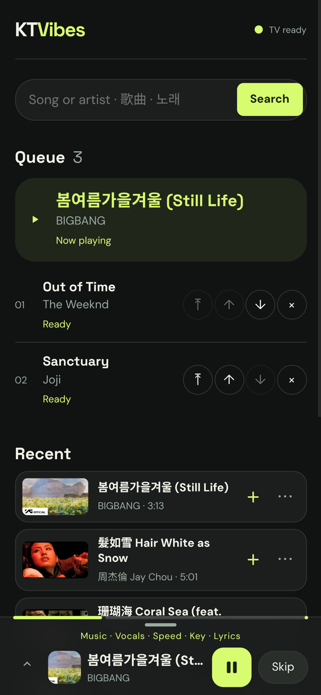
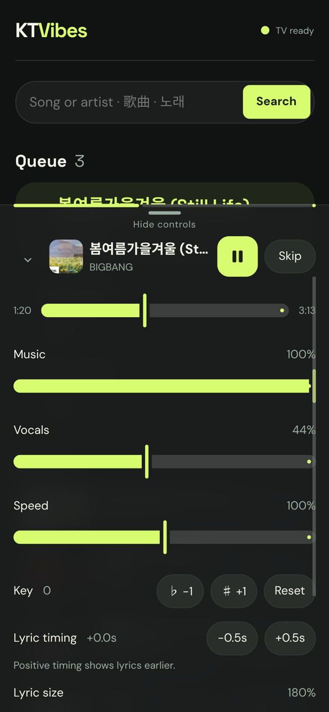
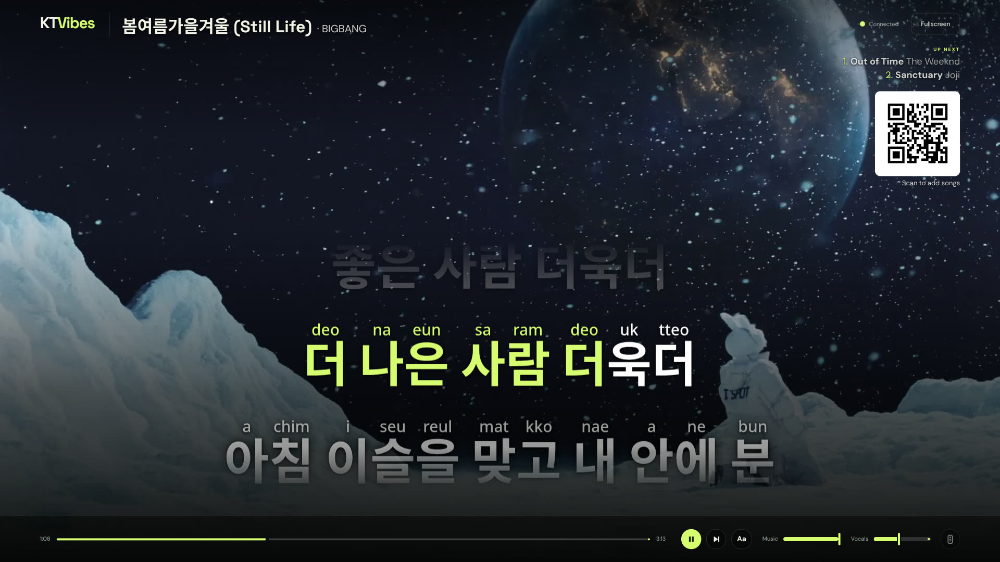

# KTVibes

**Turn any YouTube song into karaoke at home.** Pick songs on your phone, sing on the TV. KTVibes downloads the song, strips the vocals with AI, finds synced lyrics, and shows them with a KTV-style wipe. It adds pronunciation guides for Chinese, Cantonese, Korean and Japanese.


<p align="center">
  
  &nbsp;
  
</p>

## Features

- **Any song on YouTube.** Search from your phone. Results skip reactions, dance practices, mixes and karaoke tracks.
- **AI vocal removal** (Demucs) runs on an NVIDIA GPU or Apple Silicon. A **Vocals** slider keeps as much of the original singer as you want, and a **Music** slider sets the backing track.
- **Synced lyrics** come from [LRCLIB](https://lrclib.net). Each character or word fills as it is sung, timed by forced alignment against the separated vocals.
- **Pronunciation guides** sit above the lyrics. Cycle them with **G** or from the remote.
  - Chinese: pinyin, and Hangul.
  - Cantonese: jyutping. Songs written in Cantonese switch to it automatically.
  - Korean: romanization of the sung pronunciation.
  - Japanese: romaji.
  - English: Hangul.
- **Key and speed.** Shift the key ±6 semitones without changing tempo, or slow a song down without changing pitch.
- **Phone remote.** Scan the QR code on the TV to join. Everyone shares one queue: reorder, undo removals, and re-add recent songs. The TV shows a popup card for every change.
- **Lyrics language picker.** If a song has lyrics in several languages or editions (e.g. a K-pop song's Japanese release), choose which one to show.



## Install

You need a computer connected to the TV, and phones on the same Wi-Fi. An NVIDIA GPU (CUDA 12.8 driver) or an Apple Silicon Mac makes song preparation fast. Without one, KTVibes falls back to the CPU, which is slower.

**Linux / macOS**

```bash
curl -LsSf https://raw.githubusercontent.com/andyleenz/KTVibes/main/install.sh | bash
```

The script needs `git`, `ffmpeg` and Node.js 22+, and tells you how to install any that are missing (`brew install git ffmpeg node` on macOS). It installs [uv](https://docs.astral.sh/uv/), clones KTVibes to `~/KTVibes`, and adds a `ktvibes` command.

**Windows** (PowerShell, untested so far; reports welcome)

```powershell
powershell -ExecutionPolicy ByPass -c "irm https://raw.githubusercontent.com/andyleenz/KTVibes/main/install.ps1 | iex"
```

This installs Git, FFmpeg, Node.js and uv with `winget` if they are missing.

**Manual**

```bash
git clone https://github.com/andyleenz/KTVibes.git && cd KTVibes
uv sync
uv run ktvibes
```

The first song takes longer: the separation model (80 MB) and the alignment model (1.2 GB) download on first use.

## Use

1. Run `ktvibes`.
2. On the TV computer, open `http://localhost:8765/tv` and click **Enable sound**. Click **Fullscreen** if you like.
3. Scan the QR code with a phone, search for a song, and tap it to queue it.

The first song starts as soon as it is ready. Later songs are prepared while earlier ones play. Re-queuing a song is instant because everything is cached in `cache/`.

## Configuration

| Variable | Default | |
|---|---|---|
| `KTVIBES_PORT` | `8765` | Server port |
| `KTVIBES_REMOTE_URL` | detected | Address in the QR code. Set it if detection picks the wrong network, e.g. with a VPN: `http://<pc-ip>:8765/` |
| `KTVIBES_CACHE` | `./cache` | Where songs are stored, about 70 MB each |

Run a single server process: the queue and the GPU models live in memory.

## Roadmap

- Thai word splitting, for a word-by-word wipe.
- Better kanji readings for Japanese romaji.
- Docker image.

## Notes

KTVibes downloads from YouTube with [yt-dlp](https://github.com/yt-dlp/yt-dlp) for personal, at-home use. Respect the rights of artists and YouTube's terms where you live. Lyrics come from the community-run LRCLIB; coverage varies by song.

## How it works

### Running on different hardware

Python 3.12 is pinned; `uv` installs it when needed. PyTorch and torchaudio 2.7.1 come from the CUDA 12.8 index on Linux and Windows.

#### macOS (Apple Silicon)

No NVIDIA driver is needed. On macOS, `uv sync` installs the standard PyTorch 2.7.1 wheels, and Demucs runs on the Mac GPU (MPS); forced alignment runs on the CPU. Other machines without CUDA fall back to the CPU for both. Install the tools with `brew install uv ffmpeg`, then:

```bash
uv sync
uv run python -c "import torch; print(torch.__version__, torch.backends.mps.is_available())"
uv run ktvibes
```

uv's standalone Python on macOS has no CA bundle, so `ktvibes/__init__.py` sets `SSL_CERT_FILE` to certifi's bundle for model and NLTK downloads. Measured on an M1 Pro: separating a 6:00 song took 33.6 s with the model loaded, or 48.5 s on the first run, which also loads the model (the 80 MB weights were downloaded in that same run).

### Media

Each `cache/<youtube_id>/` holds `audio.m4a`, `video.mp4`, `vocals.flac`, `no_vocals.flac`, `lyrics.lrc`, `timed.json`, and `meta.json`. `timed.json` keeps the per-word timing and pronunciation guides, so re-queuing a song skips alignment; it is rebuilt when the lyrics change. The lyric timing nudge is saved in `meta.json` and applies the next time the song plays. The video is H.264, up to 1080p; embedded audio is stripped without re-encoding the video. Only the two separated tracks produce sound. The instrumental clock drives the guide vocals, video alignment, progress, and lyric highlighting. The video downloads alongside the audio and separation, and a failed video download falls back to the stage background; missing lyrics do not stop playback.

Demucs `htdemucs` loads once, runs on CUDA in a background thread, and sums the non-vocal stems. Model weights download on first use. Processing time depends on song length, network speed, and whether the model is warm; the 30-second target requires measurement on the actual GPU. Stems are stored as lossless 24-bit FLAC, 41–52% of the size of float WAV (about 65 MB instead of 150 MB for a 3–4 minute song). Separated stems often peak above full scale, which FLAC cannot store, so both are scaled down together and `meta.json` keeps the `stem_gain` the TV applies to restore the level. Songs cached as float WAV by older versions convert to FLAC (about a second) the next time they are queued. Existing stems are reused, and cached lyrics are looked up again if you edit artist/title.

[LRCLIB](https://lrclib.net/docs) supplies synced lyrics through `/api/get` and a `/api/search` fallback. Candidates must be within three seconds of the actual audio duration. Chinese and Korean lyrics use the same lookup and timing path; coverage depends on LRCLIB. Lyric lookup also tries each part of a bilingual name. `아이유(IU)` searches `아이유` and `IU`, and `周杰倫 Jay Chou` / `安靜 Silence` searches `周杰倫` + `安靜`. An empty lyric result is not cached, so the next preparation of that song looks it up again. a bare `아이유` still misses because LRCLIB files IU under the Latin name.

The TV highlights lyrics KTV-style: Chinese, Japanese, and Korean lines fill one character at a time; other scripts fill one word at a time. Enhanced LRC `<mm:ss.xx>` word stamps are used when present. LRCLIB records are usually line-timed. KTVibes times each character or word by forced alignment. torchaudio's multilingual MMS aligner, running on the GPU, matches the romanized line (pinyin, Korean romanization, or plain English letters) against the separated vocals within that line's window. Word starts are moved 0.1 s earlier because the aligner marks words slightly late. If the aligner's mean confidence for a line is below 0.2, that line uses a vocal-energy estimate instead: the line is spread across the frames where the vocals are audible.

Measured against APT. (Rosé and Bruno Mars), the only LRCLIB record found with real per-word timestamps (89 word starts): mean error 0.094 s with alignment versus 0.167 s with the energy estimate. Median error was 0.045 s versus 0.096 s, and 83% versus 64% of word starts were within 0.15 s. The 0.1 s lead and 0.2 confidence cutoff were chosen on that same song, so these numbers are optimistic. Chinese and Korean have no answer key; on cached songs, 57–100% of lines passed the confidence check. Long held notes remain the weak spot: a held first word can squeeze the next word early. The first run downloads the 1.18 GB aligner model; aligning takes 1–5 s per song.

Enhanced LRC duet tags (`v1:`, `v2:`) are removed from the displayed text and stored as the line's `voice`. A pronunciation guide sits above the lyrics and fills along with each character or word. The **Pronunciation guide** button on the remote, or the G key on the TV, cycles through the modes mid-song. The TV shows a badge for 1.5 s after each change. The cycle skips modes with nothing to show for the current song.

- **Jyutping:** Cantonese readings for Chinese characters (`ToJyutping`). It is chosen automatically when the lyrics contain written-Cantonese characters such as 嘅, 咗 or 唔.
- **Romanization (Japanese):** Japanese songs (any kana in the lyrics) get Hepburn romaji from `pykakasi`; a kanji word's reading sits on its first character, and some kanji readings are wrong.
- **Romanization:** tone-marked pinyin for Chinese, generated by `pypinyin` from the whole line so that most polyphones read correctly (还是 hái, 了解 liǎo). Korean gets romanization of the sung pronunciation.
- **한글:** Hangul for Chinese and English lines. Chinese follows the standard Korean spelling of Chinese sounds (晴天 칭톈, 周杰伦 저우제룬). English goes through the CMU pronouncing dictionary and simple Korean spelling rules (someone 섬원, crazy 크레이지). Words missing from the dictionary, such as `tryna`, get no guide. Unstressed vowels follow spoken English, so some words differ from the standard spelling (beautiful 뷰터펄, not 뷰티풀).
- **Off.**

Some readings are still wrong: for example, the particle 得 in 舍不得 shows `dé` instead of `de`. Translation is not added. Music videos with long intros may need the timing nudge, or may not have a duration-matched lyric record. Choose an audio version if the music video has extra scenes.

## Development

```bash
uv run python -m unittest discover -s tests -v
uv run pytest
uv run python -m ktvibes.youtube 'bohemian rhapsody'
uv run python -m ktvibes.lyrics 'Queen' 'Bohemian Rhapsody' 354
uv run python -m ktvibes.youtube '周杰倫 晴天'
uv run python -m ktvibes.youtube '아이유 좋은 날'
```

Standalone download and timed separation:

```bash
uv run python -c "from pathlib import Path; from ktvibes.youtube import download, download_video; p=Path('cache/fJ9rUzIMcZQ'); print(download('fJ9rUzIMcZQ', p)); download_video('fJ9rUzIMcZQ', p)"
uv run python -m ktvibes.separate cache/fJ9rUzIMcZQ/audio.m4a cache/fJ9rUzIMcZQ
```

### Known limitations

- A hidden TV tab does not start the next song, because browsers pause `requestAnimationFrame` in hidden tabs. The song starts as soon as the tab is visible again. Keep the TV page in the foreground.
- If the browser blocks autoplay (`NotAllowedError`), the Enable sound prompt appears again. Other start errors are logged to the console and retried.
- Title parsing is a best guess. Always check the artist and title before adding a song; the original-script artist name or the name LRCLIB uses gives the best lyric matches.


## Layout

`ktvibes/main.py` serves the API, WebSocket, media range requests, QR, and static pages. `queue.py` owns state, and `worker.py` prepares one entry at a time. `youtube.py`, `lyrics.py`, and `separate.py` wrap the external providers. The frontend is plain HTML/CSS/JavaScript with no build step.

The queue and the media cache persist across restarts. Microphone input, scoring and authentication are not included. The remote is intended for your local network.
